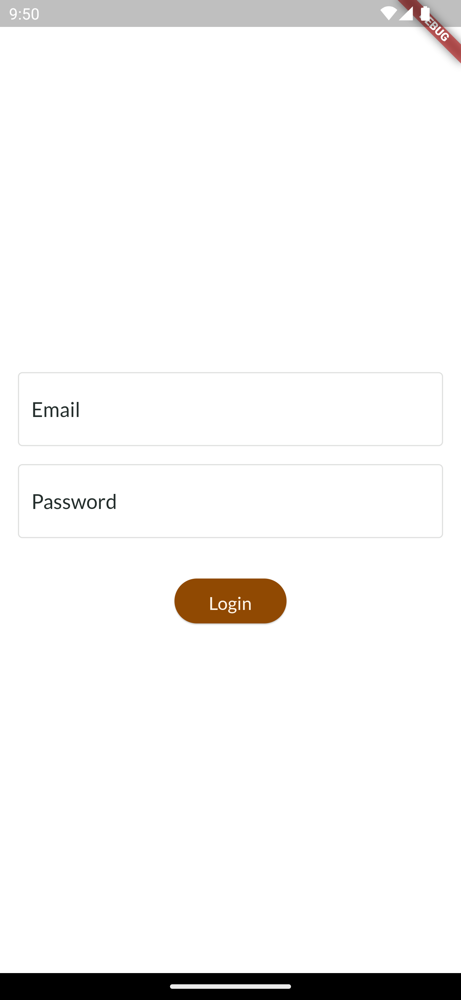
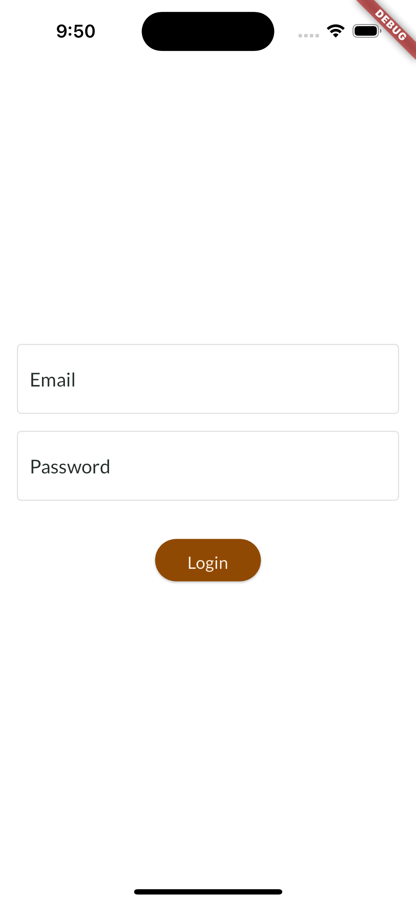

# Find events

This is an application that shows information about events in your city, built with Flutter. This project makes use
of the [SeatGeek](https://platform.seatgeek.com) API to obtain event information from a city.

## Run Locally

Install dependencies

```bash
  flutter pub get
```

Start the app

```bash
  flutter run
```

## Authentication

This application has an authentication screen, which pretends to emulate the flow behavior. To continue, you can enter any email and password, the main idea is to emulate the behavior.

| Android                                                                    | iOS                                                                    |
|----------------------------------------------------------------------------|------------------------------------------------------------------------|
|  |  |

## Demo
